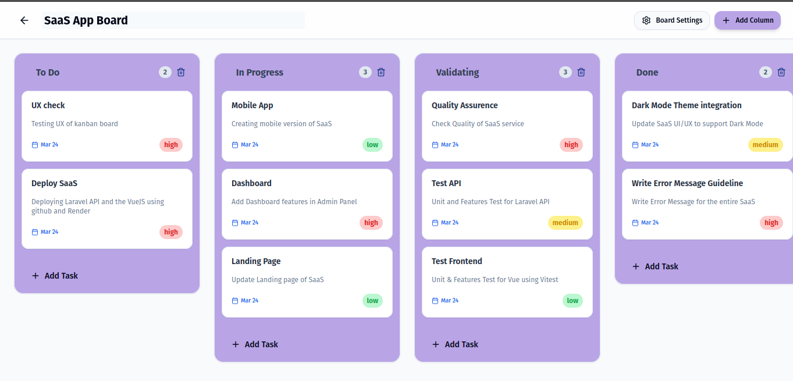

# Modern Kanban Board

A production-ready Kanban Board application (Trello-style) built with Vue 3, Vite, TailwindCSS, and Pinia.



## 🚀 Features

- **Multiple Kanbans:** Create, edit, and delete multiple project boards.
- **Columns (Lists):** Manage columns within boards with inline editing for titles.
- **Tasks (Cards):** Create tasks with titles and descriptions. Edit details in a modern dialog.
- **Drag & Drop:** Smoothly reorder tasks within columns or move them between columns. Reorder columns horizontally.
- **State Management:** Powered by Pinia with normalized data handling and optimistic updates.
- **Modern UI/UX:** Clean design inspired by Trello and Linear, featuring soft shadows, rounded-2xl cards, and a turquoise/blue theme.
- **Responsive:** Fully responsive design with horizontal scrolling for columns on desktop and mobile.
- **Toast Notifications:** Real-time feedback for all user actions.

## 🛠 Tech Stack

- **Frontend:** Vue 3 (Composition API)
- **Build Tool:** Vite
- **Styling:** TailwindCSS
- **State Management:** Pinia
- **Routing:** Vue Router
- **Drag & Drop:** vuedraggable
- **UI Components:** radix-vue (shadcn-inspired custom components)
- **API Client:** Axios
- **Icons:** Lucide Vue Next

## 📦 Installation

1. **Clone the repository**

   ```bash
   git clone <repository-url>
   cd <project-folder>
   ```

2. **Install dependencies**

   ```bash
   npm install
   ```

3. **Configure API**
   Update the base URL in `src/api/client.ts`:

   ```typescript
   const api = axios.create({
     baseURL: 'http://localhost:8000/api',
     // ...
   });
   ```

4. **Run the development server**
   ```bash
   npm run dev
   ```

## 📁 Folder Structure

- `src/api`: Axios instances and service layers.
- `src/stores`: Pinia stores for state management (kanban, column, task).
- `src/components`: Reusable UI and feature-specific components.
- `src/views`: Page components (Board List, Board Detail).
- `src/router`: Vue Router configuration.
- `src/types`: TypeScript interfaces.
- `src/lib`: Utility functions.
- `src/assets`: Global styles and static assets.

## 🔧 API Configuration

The application is designed to work with a Laravel REST API. Ensure your backend is running and the endpoints match the service definitions in `src/api/services.ts`.

## 🔮 Future Improvements

- [ ] Dark mode support.
- [ ] Keyboard shortcuts for quick task creation.
- [ ] Multi-user support with authentication.
- [ ] Task labels and due dates.
- [ ] Search and filtering for tasks.

